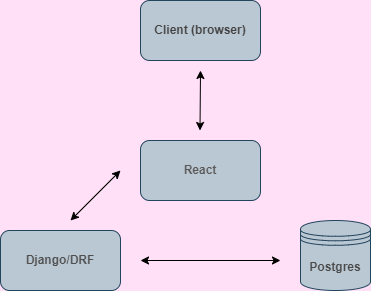
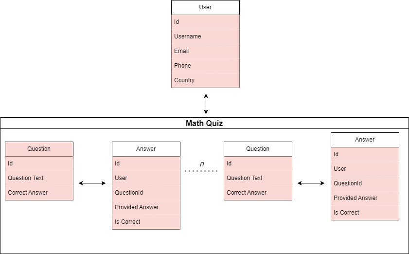

# Math App

================

## Table of Contents

- [Local Setup](#local-setup)
- [How it Works](#how-it-works)
- [Testing](#testing)
- [Security](#security)
    - [Authentication](#authentication)
    - [Authorization](#authorization)
    - [Password Hashing](#password-hashing)

A web application built using Django and React that allows users to practice math problems and track their progress. The backend handles user authentication & authorization, stores questions and users' answers in a database, and provides API endpoints for the frontend to interact with.

The React frontend includes a register & login system, a math question interface a page to show results. Authorized staff users can also view a report of scores by country. 



## Local Setup

To run the application locally, follow these steps:

1. Clone the repository: `git clone https://github.com/your-username/your-repo-name.git`
2. For the backend, in one terminal do:
```
python -m venv venv
source venv/bin/activate # or ./venv/Scripts/activate on Windows
pip install -r requirements.txt
(cd backend; python manage.py migrate --run-syncdb && python manage.py runserver)
```
3. For the frontend, do `(cd frontend; npm i; npm start)` and the application should be accessible in the browser at `http://localhost:8000` 
4. There are no intial Questions so we must create some once the backend server is running. We can do this by POSTing a set of Questions to the backend like so:

```
API_URL="http://localhost:8000/api/questions/"
QUESTIONS=(   '{"text": "2 + 2", "correct_answer": 4}'   '{"text": "5 * 3", "correct_answer": 15}'   '{"text": "10 - 4", "correct_answer": 6}'   '{"text": "7 / 1", "correct_answer": 7}'   '{"text": "9 * 9", "correct_answer": 81}' )
CSRF_TOKEN=$(python manage.py shell -c "from django.middleware.csrf import get_token; print(get_token(''))")
 for question in "${QUESTIONS[@]}"; do   curl -X POST     $API_URL     -H 'Content-Type: application/json'     -H "X-CSRFToken: $CSRF_TOKEN"     -d "$question";   echo "Posted question: $question"; done
```
I don't know how to do this on Windows so good luck with that. We can create the inital question data another way though. Make a superuser (admin) with:
```
python manage.py createsuperuser
```
And follow the prompts. Now go to `http://127.0.0.1:8000/admin/api/question/` after logging into the admin panel at `http://127.0.0.1:8000/admin/`. You can manually POST the Questions here. Go back to your React app and you should see them there. 

## How it Works

Upon registering as a normal User, we see the Questions available for User to Answer. You can see from the diagram how each User has many-to-many relationships with Questions. Each Question has a 1-to-1 relationship with each Answer. 


Users can login & out without having submitted all their Answers, but once they do, their score will be made available. 

Additionally, Users with `Staff` status (this status can be added in the Admin panel alluded to above; superusers also have this status) can access a `/report` page with additional information on scores by country. 

## Testing

Run the backend tests: `python manage.py test`. This creates a user and has them register.

## Security

Security features of the application include: 

### Authentication

The application uses Django's built-in authentication system to ensure that only authorized users can access the application.

### Authorization

The application uses Django's built-in permission system to ensure that users can only access features that they are authorized to use. An example of this is on the `/report` page. This page is only accessible to Users who are allowed 'Staff' status. 

### Password Hashing

The application uses Django's built-in password hashing system to protect user passwords from unauthorized access.